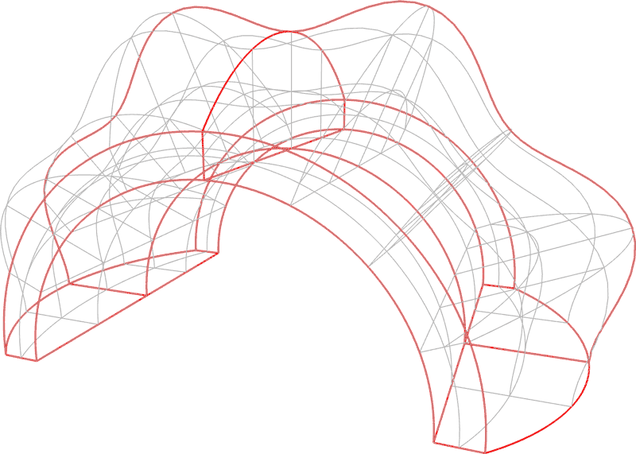

# ndarray-grid-connectivity

> Extract grid connectivity from an ndarray, presumably for drawing

[![Experimental][stability-experimental]][stability-url]
[![Build Status][travis-image]][travis-url]
[![npm version][npm-image]][npm-url]
[![Dependency Status][david-dm-image]][david-dm-url]
[![Semistandard Style][semistandard-image]][semistandard-url]

## Introduction

This module extracts grid conectivity data for a general n-dimensional ndarray. The
presumed use-case is for drawing a grid, perhaps with OpenGL lines.

If you pass the ndarray information as a buffer, you'll also need the stride of the
components (see example below). Since the stride is limited, it's highly recommended
to store the spatial components (e.g. x, y, z) sequentially in the trailing dimension.

Finally, if you use the connectivity pairs with OpenGL, you will need the
`oes_element_index_uint` extension if the size of the indices exceeds `2^16`.

## Example

The image below shows a 5 &times; 81 &times; 41 volumetric grid computed with transfinite interpolation and drawn with [regl](https://github.com/mikolalysenko/regl). The stride preserves smooth edges without actually plotting a a dense internal grid. The edges drawn in red represent the control curves and are plotted separately.

<p align="center">
  
</p>

For the simple example of a 2 &times; 2 grid in three spatial dimensions:

```javascript
var grid = require('ndarray-grid-connectivity');
var zeros = require('ndarray-scratch').zeros;
var A = zeros([2, 2, 3]);

// The index pairs for the first dimension:
grid(A.pick(null, null, 0));
// => [
//  0, 6,
//  3, 9,
//  0, 3,
//  6, 9
// ]

A.stride[2]
// => 1
```


## Installation

Will publish to npm, pending additional testing.

```bash
$ npm install ndarray-grid-connectivity
```

## Usage

#### `require('ndarray-grid-connectivity')(A, options)`
Extract connectivity information for the n-dimensional array A. The pairs are stored
sequentially in a one-dimensional `Array`.

**Options**:
- `stride`: Either one-dimensional `Array` containing the stride of the grid slices
  in each dimension, or else a two-dimensional array (indexed in this description as `i, j`)
  containing the j-stride of the slices in the ith dimension.
- `offset`: Either one or two-dimensional array containing the offset of slice strides.
- `visible`: An n-dimensional array of booleans indicating whether slices in the ith dimension
  are visible.

**Returns**: Packed connectivity information, for the n i-j line segments `[i1, j1, i2, j2, ... in, jn]`.

## License

&copy; 2016 Ricky Reusser. MIT License.


<!-- BADGES -->

[travis-image]: https://travis-ci.org/scijs/ndarray-grid-connectivity.svg?branch=master
[travis-url]: https://travis-ci.org/scijs/ndarray-grid-connectivity

[npm-image]: https://badge.fury.io/js/ndarray-grid-connectivity.svg
[npm-url]: https://npmjs.org/package/ndarray-grid-connectivity

[david-dm-image]: https://david-dm.org/scijs/ndarray-grid-connectivity.svg?theme=shields.io
[david-dm-url]: https://david-dm.org/scijs/ndarray-grid-connectivity

[semistandard-image]: https://img.shields.io/badge/code%20style-semistandard-brightgreen.svg?style=flat-square
[semistandard-url]: https://github.com/Flet/semistandard

<!-- see stability badges at: https://github.com/badges/stability-badges -->
[stability-url]: https://github.com/badges/stability-badges
[stability-deprecated]: http://badges.github.io/stability-badges/dist/deprecated.svg
[stability-experimental]: http://badges.github.io/stability-badges/dist/experimental.svg
[stability-unstable]: http://badges.github.io/stability-badges/dist/unstable.svg
[stability-stable]: http://badges.github.io/stability-badges/dist/stable.svg
[stability-frozen]: http://badges.github.io/stability-badges/dist/frozen.svg
[stability-locked]: http://badges.github.io/stability-badges/dist/locked.svg

